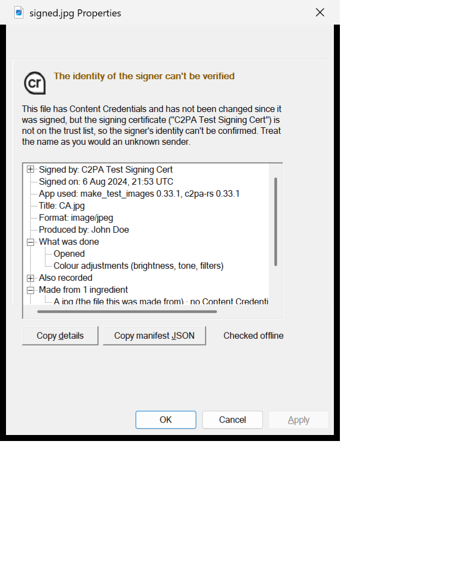

# C2PA View for Windows Explorer

Adds a **Content Credentials** tab to the Properties dialog of image, video, audio and PDF
files in Windows Explorer. It shows who signed the file, when, with what app, whether it is
AI-generated, what was done to it, what it was made from - and whether it has been changed
since it was signed.

Same idea as [c2paview.com](https://c2paview.com/), built into Explorer. 100% offline:
nothing about your files ever leaves the PC.



## Install (per user, no admin)

1. Download the latest `c2paview-tab-<version>.zip` from Releases and extract it.
2. Open PowerShell in the extracted folder and run:

   ```powershell
   powershell -ExecutionPolicy Bypass -File .\Install-C2paViewTab.ps1
   ```

3. Right-click any JPEG, PNG, WebP, AVIF, GIF, TIFF, SVG, MP4, MOV, MP3, WAV, PDF or `.c2pa`
   file > **Properties** > **Content Credentials**.

Remove it again with:

```powershell
powershell -ExecutionPolicy Bypass -File "$env:LOCALAPPDATA\C2PAView\Install-C2paViewTab.ps1" -Uninstall -RestartExplorer
```

`-RestartExplorer` is only needed to release the DLL so the files can be deleted; the
registration itself is removed immediately. Both x64 and ARM64 Windows are supported; the
installer picks the right binaries.

## What the tab shows

| State | Headline | Meaning |
|---|---|---|
| trusted | *Signed by NAME* | Intact since signing; the certificate chains to the C2PA trust list. |
| untrusted | *The identity of the signer can't be verified* | Intact since signing, but the signer is not on the trust lists. Judge the name yourself. |
| incomplete | *These Content Credentials contain incomplete provenance* | The file is intact, but an ingredient's credentials could not be verified. |
| invalid | *There is a problem with this file's Content Credentials* | Hash or signature mismatch (changed after signing), expired or revoked certificate. Details list every failed check and where it sits. |
| malformed | *…and they can't be viewed* | The credential data is damaged or not well-formed. |
| none | *No Content Credentials* | Most files. Explicitly **not** evidence of anything either way. If traces of stripped credentials remain (XMP pointers, JUMBF fragments) they are listed. |
| remote | *…stored online, not in this file* | The file points to a remote manifest. Not fetched, by design. |
| unreadable / unsupported / error | | Damaged or mislabelled file that can't be parsed as its format, a file type Content Credentials can't live in, or the helper timed out / crashed. Never presented as a credentials problem. |

Below the headline: an **AI disclosure** line when the manifest declares a digital source
type ("Fully generated with AI", "Partially edited using AI", "Captured by a camera..."),
then a tree with *Signed by*, *Signed on* (trusted timestamp only - if there is none, it says
so), *App used*, *Produced by*, *What was done* (edit history grouped into plain categories),
*Also recorded* (each assertion tagged "entered by the creator" / "recorded by the capture
device" / "recorded by the signing app"), *Made from N ingredients* (recursive, each with its
own status), *Verification checks*, and *About this check* (trust-list snapshot date, file
size, the note that nothing was sent over the network).

**Copy details** puts the whole tab on the clipboard as text; **Copy manifest JSON** copies
the full manifest store as reported by c2pa-rs (the L4 "forensic" view).

### Guideline compliance

Wording and structure follow the
[C2PA UX Recommendations 2.2](https://spec.c2pa.org/specifications/specifications/2.2/ux/UX_Recommendations.html)
and [Implementation Guidance 2.2](https://spec.c2pa.org/specifications/specifications/2.2/guidance/Guidance.html):

- L1/L2 in the headline (icon shown only when credentials are present, never modified, no
  status drawn onto the icon), L3 in the tree, L4 via *Copy manifest JSON*.
- Recommended phrases used verbatim: "The identity of the signer can't be verified", "These
  Content Credentials contain incomplete provenance", "There is a problem with this asset's
  Content Credentials and they can't be viewed" (with "asset" -> "file"), "Signed by",
  "Fully generated with AI" / "Partially edited using AI", "Recorded by the capture device" /
  "Entered by the creator".
- Yellow (warning) headline for untrusted / incomplete, red (alert) for invalid / malformed.
- Untrusted-but-intact is never shown as a failure, and *no credentials* is never implied to
  mean *less trustworthy*. Nothing in the UI claims a file is "authentic" or "true".
- "Content Credentials" is used throughout (not "C2PA") except where the C2PA organisation's
  own trust list is named.
- Trusted timestamps are shown; their absence is flagged with the certificate-expiry caveat.
- Remote manifests are never fetched (privacy guidance on soft bindings / remote lookups).
- All manifest text is character-filtered (control and bidi-override characters removed,
  lengths capped) before display, as the guidance's "code injection" note asks.

## Privacy and security model

- **No network, ever, at runtime.** The helper is compiled without an HTTP client, remote
  manifest fetching and OCSP are disabled, and trust lists are read from disk. The only
  script that goes online is `Update-TrustLists.ps1`, when you run it.
- **Explorer can't be crashed by a bad file.** `c2paview.dll` (~600 lines of C++) never
  parses the file. It launches `c2paview-helper.exe` and reads a text protocol back. The
  helper:
  - is the C2PA reference implementation ([c2pa-rs](https://github.com/contentauth/c2pa-rs))
    - memory-safe Rust, pure-Rust crypto;
  - runs as a **low-integrity, restricted-token** process (it can read the file and the trust
    lists; it cannot write to your profile or registry - the same isolation IE Protected Mode
    used);
  - is inside a **job object** with a 2 GB memory cap, one-process limit, and
    kill-on-close so it dies with Explorer;
  - has a 45 s timeout and a 16 MB output cap; if it crashes, panics or times out the tab
    says so instead of failing silently.
- **Per-user only.** Everything lives in `%LOCALAPPDATA%\C2PAView` and `HKCU\Software\Classes`.
  Nothing system-wide is touched, no admin needed.
- **Registered per extension**, not for `*`, so the DLL is only loaded when you open
  Properties on a supported file type.
- Static CRT, `/guard:cf`, `/CETCOMPAT` (x64), DEP/ASLR. No installer executable - a readable
  PowerShell script does the registration.

Trade-off you should know: **the binaries are not code-signed.** The DLL is loaded by
Explorer from your own profile; SmartScreen does not apply to shell extensions, but if your
organisation sets the `EnforceShellExtensionSecurity` policy, per-user shell extensions are
blocked and this will not appear. Verify downloads against `SHA256SUMS.txt`.

## Trust lists

The helper distinguishes "intact" from "intact **and** signed by a known party" using:

- the C2PA Conformance Program trust list and TSA trust list
  (`c2pa-org/conformance-public`);
- the interim Content Credentials list from contentcredentials.org, which most production
  assets still chain to.

They ship as a snapshot (`trust/VERSION.txt` has the date; the tab shows it). Refresh:

```powershell
powershell -ExecutionPolicy Bypass -File "$env:LOCALAPPDATA\C2PAView\Update-TrustLists.ps1"
```

## Building

Everything is built by GitHub Actions (`.github/workflows/build.yml`) on `windows-latest`
for x64 and ARM64; tagging `vX.Y.Z` publishes a release with the zip and checksums.

Locally you need Rust (1.96+) and Visual Studio Build Tools with the C++ workload
(plus the ARM64 components for an ARM64 build):

```powershell
cargo build --release -p c2paview-helper                # target\release\c2paview-helper.exe
cargo test  --release -p c2paview-helper                # uses samples\signed.jpg and trust\
.\shellext\build.ps1 -Arch x64                          # build\x64\c2paview.dll
# assemble a release layout and install from it
New-Item -Force -ItemType Directory stage\bin\x64 | Out-Null
Copy-Item build\x64\c2paview.dll, target\release\c2paview-helper.exe stage\bin\x64\
.\scripts\Package.ps1 -BinDir stage\bin -OutDir dist
.\dist\c2paview-tab-*\Install-C2paViewTab.ps1
```

Debugging the helper on its own:

```powershell
"$env:LOCALAPPDATA\C2PAView\c2paview-helper.exe" --trust-dir "$env:LOCALAPPDATA\C2PAView\trust" -- .\photo.jpg
"$env:LOCALAPPDATA\C2PAView\c2paview-helper.exe" --json -- .\photo.jpg     # raw c2pa-rs JSON
```

## Layout

```
helper/        Rust: c2paview-helper (c2pa-rs reader -> line protocol)
shellext/      C++: c2paview.dll (IShellExtInit + IShellPropSheetExt, sandboxed launch, UI)
scripts/       Install-C2paViewTab.ps1, Update-TrustLists.ps1, Package.ps1
trust/         trust-list snapshot + VERSION.txt
assets/        official Content Credentials icon (+ provenance notes)
samples/       signed.jpg - C2PA test fixture (test certificate -> "signer can't be verified")
```

## Licence

MIT - see [LICENSE](LICENSE). Bundled third-party components and the Content Credentials
trademark are listed in [THIRD-PARTY.md](THIRD-PARTY.md).

Built by Adam Woodland with the assistance of AI (Anthropic Claude).
